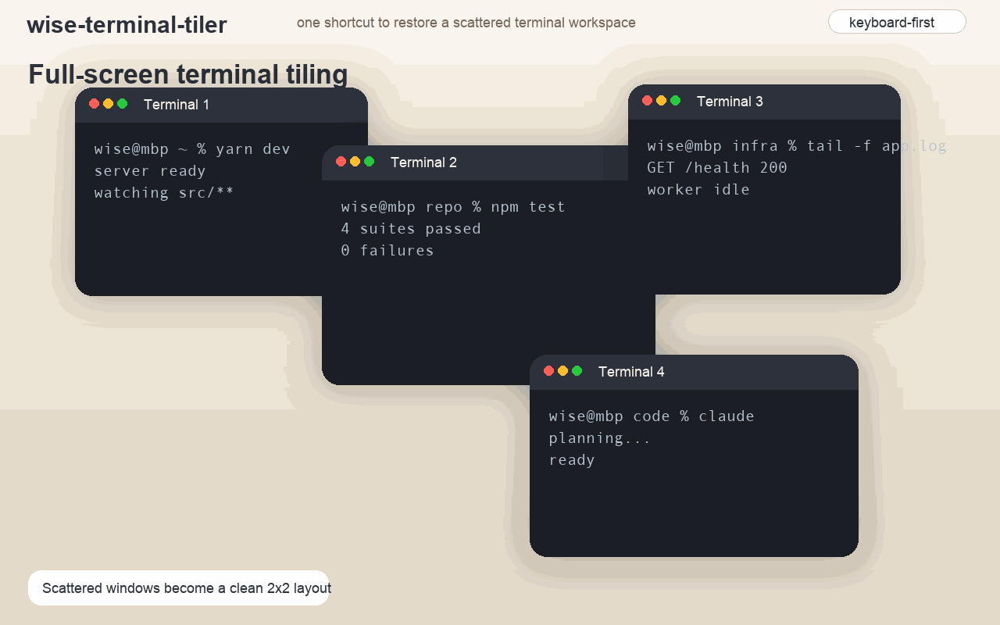
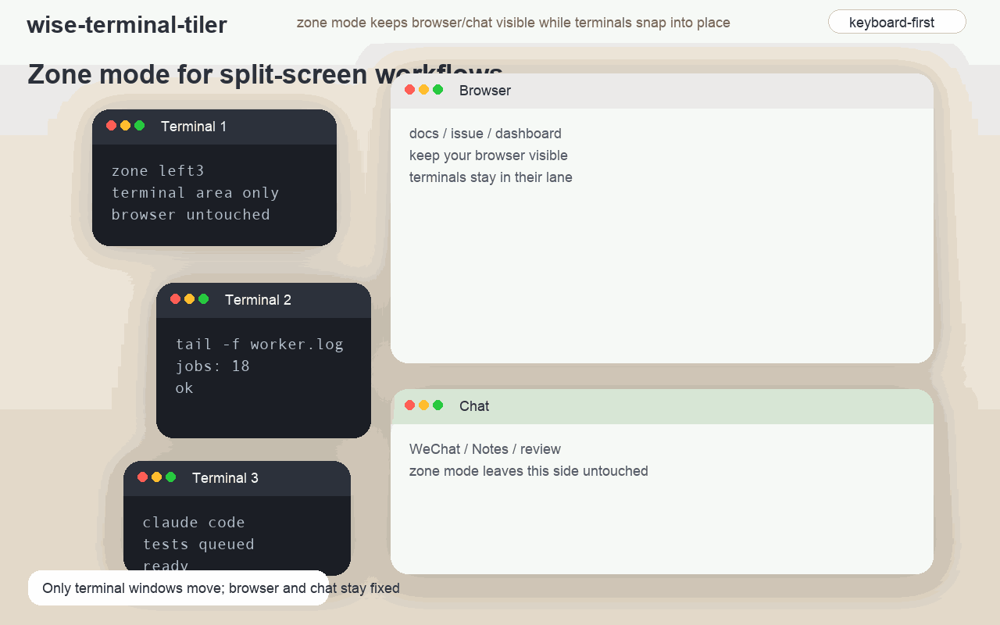

# wise-terminal-tiler

<p align="center">
  <a href="./README.en.md">English</a> | <a href="./README.md">中文</a> | <a href="./AGENTS.md">Agent / AI</a>
</p>

> A lightweight macOS utility for terminal window tiling.
>
> One shortcut to restore a scattered terminal workspace.
>
> Built for multi-terminal, multi-display, keyboard-first workflows.

## One-click cleanup


## Zone mode


## At a Glance

- Tile 2 to 10 terminal windows in one action
- Supports iTerm2, Terminal, and Ghostty
- Groups and arranges windows by display
- Includes zone mode to leave space for browser or chat
- Best for people who prefer real windows over pane-heavy workflows

## Quick Start

```bash
git clone https://github.com/WiseWong6/wise-terminal-tiler.git
cd wise-terminal-tiler

mkdir -p ~/.local/bin
cp scripts/terminal-tile-all ~/.local/bin/
cp scripts/terminal-tile-hotkey ~/.local/bin/
cp scripts/zone ~/.local/bin/
chmod +x ~/.local/bin/terminal-tile-all
chmod +x ~/.local/bin/terminal-tile-hotkey
chmod +x ~/.local/bin/zone

~/.local/bin/terminal-tile-hotkey bootstrap
```

---

## What Problem This Solves

If your default habit is to open another terminal window instead of splitting the current one, macOS gets messy quickly.

Claude Code may feel better in Ghostty, while other tasks still live in iTerm2 or Terminal. After a while, your desktop fills up with independent terminal windows. You switch to the browser, check chat, come back, and the layout is gone.

Manual resizing works, but it breaks flow every time.

`wise-terminal-tiler` is built for that exact gap: restore order to a multi-terminal workspace with a single shortcut.

---

## Why Existing Tools Fall Short

| Tool | Good at | Why it still misses the mark | What this project adds |
|------|---------|------------------------------|------------------------|
| `tmux` | Sessions, panes, remote continuity | Requires a separate pane workflow and does not help with local mixed terminal apps | Focuses on local independent terminal windows |
| iTerm2 Split Panes | Splitting inside one window | Not cross-window orchestration | Handles real windows across apps |
| Manual drag and resize | Full control | Slow and repetitive | One trigger, consistent layout |
| Full window managers | Whole-desktop control | Heavier than needed for this use case | Solves only terminal layout |

---

## Scope

### It does

- Detect open iTerm2, Terminal, and Ghostty windows
- Tile them into fixed layouts for 2 to 10 windows
- Group windows by display
- Support zone mode for split-screen workflows
- Trigger through a system hotkey, defaulting to `ctrl+command+t`

### It does not

- Replace tmux, zellij, or pane managers
- Manage non-terminal application windows
- Target SSH or remote workflows
- Support Windows or other non-macOS platforms

---

## Typical Workflows

- Split-screen setup: terminals on one side, browser or chat on the other
- Three-zone setup: terminal strip, browser, and chat side by side
- Content or dev workflow: multiple terminals running in parallel while leaving room for docs and previews

---

## Installation

This project is intentionally built for macOS and MacBook-style terminal workflows. If you mainly work on Windows, this project does not support that workflow yet, though you are free to adapt the code yourself.

```bash
git clone https://github.com/WiseWong6/wise-terminal-tiler.git
cd wise-terminal-tiler

mkdir -p ~/.local/bin
cp scripts/terminal-tile-all ~/.local/bin/
cp scripts/terminal-tile-hotkey ~/.local/bin/
cp scripts/zone ~/.local/bin/
chmod +x ~/.local/bin/terminal-tile-all
chmod +x ~/.local/bin/terminal-tile-hotkey
chmod +x ~/.local/bin/zone

# Recommended once after install
~/.local/bin/terminal-tile-hotkey bootstrap
```

---

## Usage

### Hotkey trigger

- Default binding: `ctrl+command+t`
- If it conflicts, the tool prompts for another combo such as `cmd+shift+t`, or you can enter `skip`

```bash
terminal-tile-hotkey status
terminal-tile-hotkey set cmd+shift+t
terminal-tile-hotkey uninstall
```

### Zone Mode

Zone mode is designed for terminal-plus-browser or terminal-plus-chat workflows. It only rearranges terminal windows and leaves everything else alone.

```bash
# Short form
zone 左4
zone left4
```

Notes:

- The default hotkey still runs full-screen terminal tiling
- `zone left4` or `zone 左4` only moves terminal windows
- In zone mode, `n <= 6` stacks vertically and `n > 6` falls back to the grid layouts below

### Advanced parameters

| Variable | Default | Meaning |
|----------|---------|---------|
| `TILE_GAP` | `10` | Window gap |
| `TILE_MARGIN_TOP` | `6` | Top margin |
| `TILE_MARGIN_RIGHT` | `8` | Right margin |
| `TILE_MARGIN_BOTTOM` | `8` | Bottom margin |
| `TILE_MARGIN_LEFT` | `8` | Left margin |
| `TILE_MODE` | — | Set `iterm_fast` for the faster iTerm2-only path |

```bash
TILE_DEBUG=1 terminal-tile-all
TILE_MODE=iterm_fast terminal-tile-all
```

---

## Layout Policy

| Window count | Layout |
|--------------|--------|
| 2 | 2×1 |
| 3 | 3×1 |
| 4 | 2×2 |
| 5–6 | 3×2 |
| 7–8 | 4×2 |
| 9 | 3×3 |
| 10 | 4×3 |

In zone mode, for example `zone left4`, `n <= 6` uses a vertical stack. Larger counts fall back to the standard grid layouts.

---

## Tested Compatibility

Validated on macOS with:

- macOS `26.2` (`25C56`)
- iTerm2 `3.6.8`
- Terminal `2.15`
- Ghostty `1.2.3`

Current practical guidance:

- Best on a single display and single Space setup
- Built for local macOS workflows
- Not tested for terminals beyond iTerm2, Terminal, and Ghostty
- Not intended for Windows

### Permission note

The hotkey only works on the terminal windows you are actively using. iTerm2 and Ghostty both rely on Accessibility permission before the script can control them:

- System Settings -> Privacy & Security -> Accessibility -> add Ghostty

---

## Socials and WeChat

<div align="center">
  <p>Same handle everywhere: <code>@歪斯Wise</code></p>
  <p>
    <a href="https://www.xiaohongshu.com/user/profile/61f3ea4f000000001000db73">Xiaohongshu</a> /
    <a href="https://x.com/killthewhys">Twitter(X)</a> /
    Scan for WeChat
  </p>
  
</div>

---

## Star History

[](https://www.star-history.com/#WiseWong6/wise-terminal-tiler&Date)
